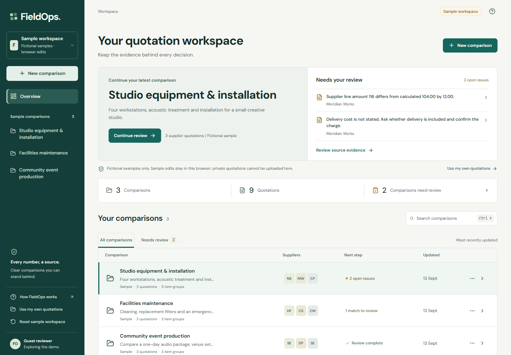
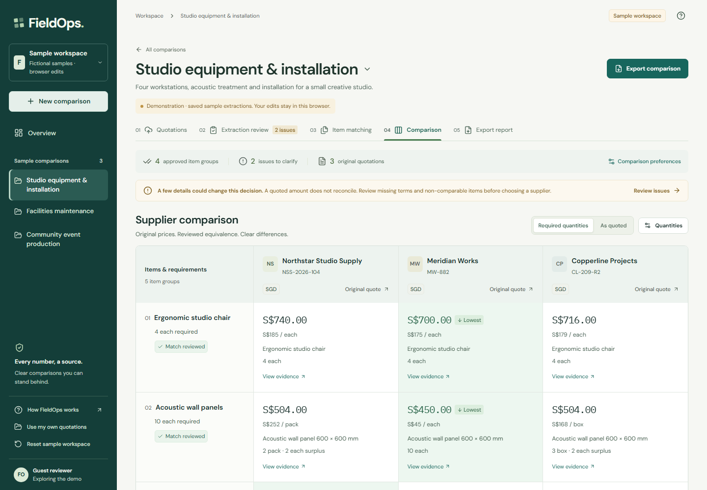

# FieldOps

[Open the live demo](https://fieldops-eight-blue.vercel.app) · [Reliability evidence](https://fieldops-eight-blue.vercel.app/reliability) · [Build checks](https://github.com/Chi944/fieldops/actions)



An evidence-first workspace for comparing supplier quotations across goods and services. Review each supplier's original document, correct uncertain fields, approve comparable items, and export a comparison whose assumptions remain visible.

FieldOps is a new, independent portfolio project. Its first release favors defensible comparisons over a universal-format claim.

See the [current production-readiness record](docs/production-readiness.md) for verified personal-pilot behavior and the remaining AI release gates. Private cloud recovery is documented [here](docs/cloud-recovery.md).

## Current capabilities

| Mode | What works | Boundaries |
| --- | --- | --- |
| Public demonstration | Connected workspace, source review, item grouping, comparison scenarios, Excel and print report using labeled synthetic quotations | Browser-local sample data; no private uploads or live model calls |
| Local workspace | Persistent comparisons, real PDF/image/spreadsheet/text parsing, private originals, progress/cancel/retry, audited manual entry and corrections, identifier/text matching | Explicit loopback-only mode; one local buyer; the server must remain running |
| Private cloud pilot | Invited GitHub sign-in, Neon database/private originals, production Trigger processing, source review, audited corrections, comparison and exports | Hosted parser/manual workflow verified; AI remains disabled pending complete-document reliability checks. Free allowances can pause processing. |
| AI integration | Configurable Groq adapter, validated structured responses, source checks, bounded calls and resumable checkpoints | Free account and inference ZDR configured; tiny synthetic live extractions passed. Larger development failures are retained; broad accuracy and held-out results are not yet established. |

The manual path is usable while AI is disabled: upload a quotation, inspect preserved source text and locations, add reviewed lines, approve conservative match groups, then compare and export. Missing values remain missing; manually entered values are labeled user corrections.

## Run locally

For your own quotations, use the isolated personal workspace:

```powershell
npm ci
npm run personal:check
npm run personal
```

Open the ready URL printed in the terminal (normally `http://127.0.0.1:3001`). Your comparisons and originals persist in `.fieldops/personal`; sample data stays separate. AI defaults off; `npm run personal -- --ai` explicitly enables the privately configured free model. See [personal use, backups and recovery](docs/personal-use.md) for the complete workflow. English OCR is already checked by the launcher; install its language asset below when needed.

For ordinary application development:

Use Node.js 24 and npm. From this repository:

```powershell
npm ci
npx tsx scripts/process.ts --prepare-ocr
$env:FIELDOPS_LOCAL_MODE = "true"
npm run dev -- --port 3002
```

Open [http://127.0.0.1:3002](http://127.0.0.1:3002). OCR setup downloads the English language data once; text-only workflows do not need it. Leave the Groq key empty and both confirmation flags false. With no environment configuration, the application opens the labeled demo instead.

For persistent environment configuration, copy `.env.example` to `.env.local` and set `FIELDOPS_LOCAL_MODE=true`. Local originals and saved work live in the gitignored `.fieldops` directory. Never expose this mode through a tunnel or bind it to a public interface.

## Reliability evidence

The 20 September hardening run passed **299 unit/integration tests across 35 files**, including six real concurrent PostgreSQL tests. TypeScript, ESLint and the production build pass; the runtime dependency audit reports zero findings. Browser checks exercise actual uploads through manual review, approved matching, Excel and PDF export, persistence, evidence viewing, keyboard use and accessibility. Exact browser timings, hosted checks and deployment revisions are recorded in [release verification](docs/release-verification.md).

Five hosted synthetic originals—text PDF, scanned PDF, PNG, XLSX and CSV—completed production parsing with 197 source spans. A read-only backup restored all five originals and their hashes into a separate local workspace. The private status panel reports original-file capacity, pending cleanup and job counts; an operator can pause new cloud uploads while retaining access to saved comparisons. These checks support an invited personal pilot, not unrestricted production AI. The [latest AI review](docs/ai-reliability-2026-09-20.md) records eight development responses, six rejections and no complete multi-item quotation; hosted AI remains off.

The [measured evaluation](docs/evaluation-report.md) distinguishes parser coverage and the identifier/text baseline from unverified AI metrics. It records dataset size, denominators, hashes, per-file results and limitations. The synthetic benchmark covers unrelated sectors, goods and services, scans, currencies, packages, tiers, revisions and malformed inputs. A held-out split is maintained separately from prompt development.

```powershell
npm run typecheck
npm run lint
npm test
npm run build
npm run eval -- --mode baseline
```

Server tests exercise real filesystem persistence and the actual SQL migrations in embedded PostgreSQL, including revision conflicts, owner isolation, cancellation, expired leases, deletion, quota reservations and manual recovery. The active Neon SQL harness stubs only managed Auth tables from inspected types; the historical Supabase migration suite remains for regression history. Embedded tests do not establish hosted OAuth, object-storage or worker acceptance.

## Design and implementation

TypeScript, Next.js and React provide the interface and server API. Decimal.js owns monetary calculations. PDF.js, Tesseract, ExcelJS and CSV parsing preserve source evidence. Neon supplies the relational database, managed Auth and private object storage; Trigger.dev runs the same processing function used by the local runner. Supabase is no longer an application dependency.

- [Setup, recovery and API contracts](docs/setup.md)
- [Personal launch, backup and restore](docs/personal-use.md)
- [Free-tier deployment instructions](docs/deployment.md) and [zero-spend boundaries](docs/free-services.md)
- [Verified Trigger development setup](docs/trigger-development.md) and [current Neon database evidence](docs/neon-replacement-verification.md)
- [Architecture and data model](docs/architecture.md)
- [Security and retention behavior](docs/security-and-retention.md) and [dependency review](docs/dependency-review.md)
- [Release verification](docs/release-verification.md)
- [Next release and deployment gates](docs/next-release.md)
- [Generated screen reference and visual refinement](docs/design/README.md)
- [Product scope](docs/spec.md) and [implementation milestones](docs/implementation-plan.md)
- [Measured evaluation](docs/evaluation-report.md) and [fixed failure](docs/failure-notes.md)
- [Portfolio case study](docs/case-study.md) and [short demonstration script](docs/demo-script.md)

Supported inputs are bounded English printed quotations: text/scanned PDF, PNG/JPEG, XLSX, CSV and pasted text. DOCX, handwriting, universal document interpretation, automatic exchange rates, supplier outreach and autonomous purchasing are outside this release. Hosted AI remains disabled while the configured free provider is evaluated; successful tiny examples do not establish support for every advertised parser format.

## Portfolio walkthrough

- [Three-minute demonstration script](docs/demo-script.md)
- [Case study and observed failure](docs/case-study.md)
- [Acceptance status and verification limits](docs/acceptance-status.md)
- [Browser test instructions](tests/e2e/README.md)



These six captures use fictional samples in the latest **local production build**; they do not imply the public deployment has been refreshed.

| Screen | Desktop | Mobile |
| --- | --- | --- |
| Workspace | [Review queue and comparisons](docs/design/fieldops-workspace-desktop-production.png) | [Workspace at 390px](docs/design/fieldops-workspace-mobile-production.png) |
| Source review | [Fields and source evidence](docs/design/fieldops-review-desktop-production.png) | [Review at 390px](docs/design/fieldops-review-mobile-production.png) |
| Comparison | [Supplier matrix](docs/design/fieldops-matrix-desktop-production.png) | [Matrix at 390px](docs/design/fieldops-matrix-mobile-production.png) |
