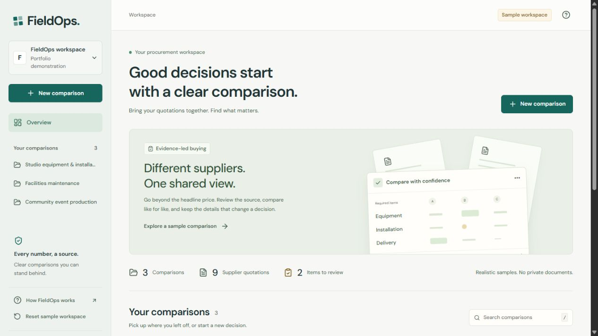
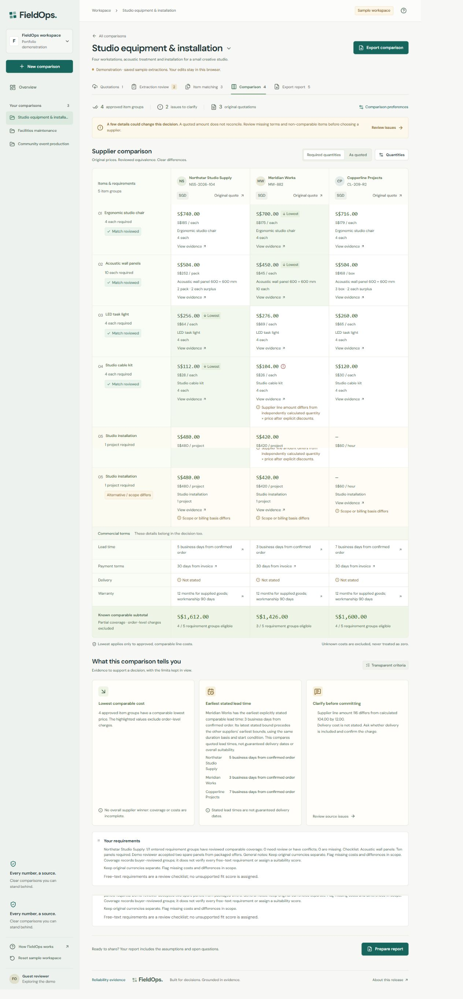

# FieldOps

[Open the live demo](https://fieldops-eight-blue.vercel.app) ? [Reliability evidence](https://fieldops-eight-blue.vercel.app/reliability) ? [Build checks](https://github.com/Chi944/fieldops/actions)



An evidence-first workspace for comparing supplier quotations across goods and services. Review each supplier's original document, correct uncertain fields, approve comparable items, and export a comparison whose assumptions remain visible.

FieldOps is a new, independent portfolio project. Its first release favors defensible comparisons over a universal-format claim.

## Current capabilities

| Mode | What works | Boundaries |
| --- | --- | --- |
| Public demonstration | Connected workspace, source review, item grouping, comparison scenarios, Excel and print report using labeled synthetic quotations | Browser-local sample data; no private uploads or live model calls |
| Local workspace | Persistent comparisons, real PDF/image/spreadsheet/text parsing, private originals, progress/cancel/retry, audited manual entry and corrections, identifier/text matching | Explicit loopback-only mode; one local buyer; the server must remain running |
| Private cloud pilot | Supabase migrations, GitHub invitation checks, private upload/download contracts and Trigger task implementation are included | Requires operator configuration and hosted acceptance checks; no hosted verification is implied |
| AI integration | Configurable Groq adapter, validated structured responses, source checks, bounded calls and resumable checkpoints | **Disabled until configured. No live extraction or semantic-matching accuracy is claimed.** |

The manual path is usable while AI is disabled: upload a quotation, inspect preserved source text and locations, add reviewed lines, approve conservative match groups, then compare and export. Missing values remain missing; manually entered values are labeled user corrections.

## Run locally

Use Node.js 24 and npm. From this repository:

```powershell
npm ci
npx tsx scripts/process.ts --prepare-ocr
$env:FIELDOPS_LOCAL_MODE = "true"
npm run dev
```

Open [http://127.0.0.1:3000](http://127.0.0.1:3000). OCR setup downloads the English language data once; text-only workflows do not need it. Leave the Groq key empty and both confirmation flags false. With no environment configuration, the application opens the labeled demo instead.

For persistent environment configuration, copy `.env.example` to `.env.local` and set `FIELDOPS_LOCAL_MODE=true`. Local originals and saved work live in the gitignored `.fieldops` directory. Never expose this mode through a tunnel or bind it to a public interface.

## Reliability evidence

Verified locally: **94 unit/integration tests and six browser workflows pass**. TypeScript, ESLint and the production build pass. The deployed demo is independently usable without database or model credentials. Linux CI repeats the checks from a clean checkout.

The [measured evaluation](docs/evaluation-report.md) distinguishes parser coverage and the identifier/text baseline from unverified AI metrics. It records dataset size, denominators, hashes, per-file results and limitations. The synthetic benchmark covers unrelated sectors, goods and services, scans, currencies, packages, tiers, revisions and malformed inputs. A held-out split is maintained separately from prompt development.

```powershell
npm run typecheck
npm run lint
npm test
npm run build
npm run eval -- --mode baseline
```

Server tests exercise real filesystem persistence and the actual SQL migrations in embedded PostgreSQL, including revision conflicts, owner isolation, cancellation, expired leases, deletion, quota reservations and manual recovery. The SQL harness stubs Supabase-owned authentication and storage schemas; it does not establish hosted Supabase compatibility by itself.

## Design and implementation

TypeScript, Next.js and React provide the interface and server API. Decimal.js owns monetary calculations. PDF.js, Tesseract, ExcelJS and CSV parsing preserve source evidence. Supabase supplies the optional relational database, OAuth and private storage; Trigger.dev runs the same processing function used by the local runner.

- [Setup, recovery and API contracts](docs/setup.md)
- [Free-tier deployment instructions](docs/deployment.md)
- [Architecture and data model](docs/architecture.md)
- [Security and retention behavior](docs/security-and-retention.md)
- [Product scope](docs/spec.md) and [implementation milestones](docs/implementation-plan.md)
- [Measured evaluation](docs/evaluation-report.md) and [fixed failure](docs/failure-notes.md)
- [Portfolio case study](docs/case-study.md) and [short demonstration script](docs/demo-script.md)

Supported inputs are bounded English printed quotations: text/scanned PDF, PNG/JPEG, XLSX, CSV and pasted text. DOCX, handwriting, universal document interpretation, automatic exchange rates, supplier outreach and autonomous purchasing are outside this release. Hosted AI behavior remains unverified until an explicitly configured free provider is evaluated.

## Portfolio walkthrough

- [Three-minute demonstration script](docs/demo-script.md)
- [Case study and observed failure](docs/case-study.md)
- [Acceptance status and verification limits](docs/acceptance-status.md)
- [Browser test instructions](tests/e2e/README.md)


