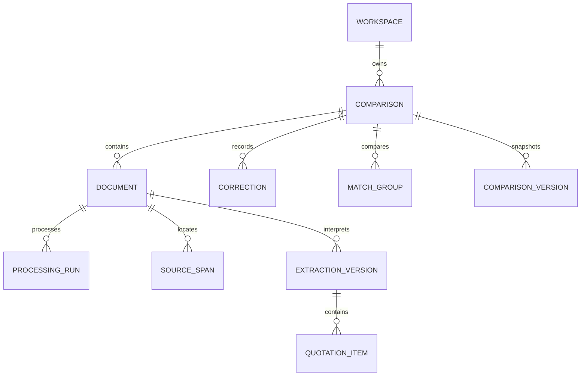
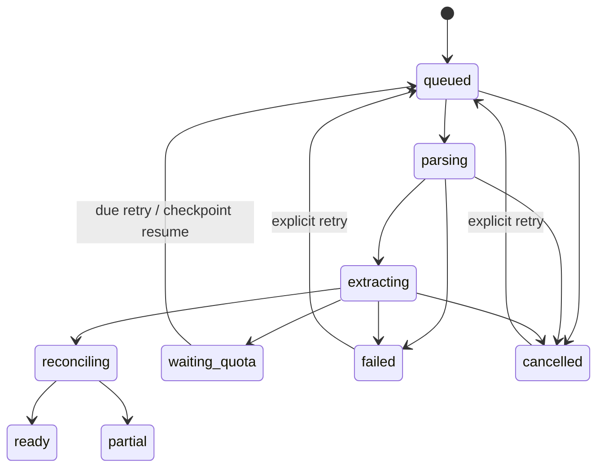

# Architecture

FieldOps separates document interpretation from deterministic purchasing calculations. Its source-review and comparison views use one shared schema in demo, local and optional cloud modes. The public demo never calls a pretend extraction endpoint.

## Runtime components

```mermaid
flowchart LR
  Buyer[Buyer browser] --> UI[Next.js and React workspace]
  UI --> Demo[Labeled fixtures and browser-local edits]
  UI --> API[Validated server API]
  API --> Auth[Neon managed Auth / GitHub invitation]
  API --> Local[Local atomic repository]
  API --> PG[Neon PostgreSQL / restricted server role]
  Buyer -->|Short-lived upload ticket| Storage[Neon private object storage]
  API --> Storage
  Local --> Pump[Local bounded runner]
  PG --> Dispatch[Persistent processing run]
  Dispatch --> Trigger[Trigger document task]
  Pump --> Pipeline[Shared document pipeline]
  Trigger --> Pipeline
  Storage --> Pipeline
  Pipeline --> Parsers[PDF.js / Tesseract / ExcelJS / CSV]
  Parsers --> Evidence[Source spans and coverage manifest]
  Evidence --> Gate{AI explicitly configured?}
  Gate -->|No| Manual[Source-only review and manual entry]
  Gate -->|Yes| AI[Validated extraction adapter]
  AI --> Reconcile[Deterministic reconciliation]
  Manual --> Groups[Reviewed match groups]
  Reconcile --> Groups
  Groups --> Engine[Decimal calculation engine]
  Engine --> Exports[Matrix / Excel / print report]
```

The local runner and Trigger task call the same `executeRun` function. Storage and job implementations differ behind a repository interface; parsing, structured interpretation, source checks and reconciliation do not. Local mode uses one process/machine and explicit loopback access. Cloud mode uses personal OAuth identities, PostgreSQL transactions and private object storage.

## Data and provenance

PostgreSQL stores a validated comparison snapshot for efficient UI reads and relational projections for ownership, jobs, source spans, extraction versions, corrections and item/group records. The consolidated [Neon migration](../neon/migrations/202609180001_fieldops.sql) defines those relations and server-only transactions. Its restricted runtime role can read the necessary fields and execute approved mutation functions; it cannot directly write comparison tables or read managed OAuth/session secrets. Every API request rechecks session expiry/revocation, GitHub identity and invitation. The local repository stores the equivalent current snapshot and immutable extraction/correction records in a private atomic JSON file; it does not offer a full local comparison-version browser.

Each extracted field keeps `state`, `value`, original `raw` text, `sourceIds` and `origin`. States distinguish a stated value (including zero), not stated, not applicable and ambiguous. Origins distinguish supplier interpretation, deterministic calculation and user correction. Typed optional attributes preserve specifications and sector-specific information without guessing a universal category.

Sources identify a document and actual parser location: PDF page/box, OCR page/line box, sheet/cell or text excerpt. Coordinates exist only when supplied by a parser. User-entered rows may cite user-selected spans from that quotation; without a selection their source IDs remain empty. Editing a field preserves its original references and records before/after values, author, reason, timestamp and base revision. Manual values remain user-origin even when linked. Evidence points to what the supplier stated, not proof that a later user correction appeared in the source.

## Processing and recovery

1. Validate extension, size and comparison limits. Compute SHA-256 and detect duplicates within the comparison. An intentional duplicate/revision remains possible.
2. Save a durable upload intent. Cloud bytes go directly to a temporary private object; finalize checks exact size and SHA-256 before writing the canonical original and dispatching. An upload ticket never authorizes overwriting a canonical original. Deletion outbox records remain for six minutes so cleanup can remove any temporary object recreated before a ticket expires.
3. Claim a 30-second lease with a new execution fence. Process one document at a time; heartbeat renewal cannot overwrite the processing stage.
4. Parse each supported page/sheet/text unit. Save source spans and the coverage manifest before model extraction. Unsupported or skipped units remain visible.
5. If AI is configured, interpret bounded chunks through a validated schema with source-ID checks and persistent request checkpoints. Otherwise retain the real parse and present explicit manual recovery.
6. Reconcile line arithmetic, totals, missing fields and coverage using deterministic code. Publish only when the document, cancellation state and execution fence still match.
7. Preserve any newer user correction. A result that would replace corrected data is saved as a separate extraction candidate; the run reports partial review. The first release does not automatically merge that candidate into user edits.

API mutations require the current `baseRevision`. Every saved comparison advances its revision. Cancellation and retry change the valid execution fence; late workers cannot publish over a newer task or deleted document. Trigger dispatch uses a stable idempotency key for a given run/fence. Persisted queued runs act as a dispatch outbox; the scheduled reconciliation task recovers uncertain dispatches. Deletion has its own persisted storage-cleanup outbox.

Transient failures receive bounded retries. Quota waits persist their next resume time, reuse completed chunks and do not consume failure attempts. The Trigger implementation suspends on waitpoints; local processing resumes from its poll loop. Application budget reservations constrain admission without pretending to measure a provider invoice.

## Comparison rules

- Decimal.js performs monetary arithmetic; API/database boundaries use decimal strings. Supplier totals are never replaced by a calculated total to hide a discrepancy.
- Currencies remain separate unless the buyer supplies a rate with direction, value, date and source. No current rate is fetched or invented.
- Unit conversion requires a known dimension and factor. Package conversion requires explicit contents, and surplus/minimum-order decisions remain visible.
- Quantity tiers, discounts, billing basis and periods participate explicitly. Hourly, recurring and fixed-scope service prices are not automatically equivalent.
- Match suggestions are proposals. Identifiers or similar text alone do not override conflicting specifications, dimensions, scope or billing periods.
- Approved groups become stale after relevant edits. Unmatched rows, alternatives and excluded/incomparable choices remain available for review.
- Costs are labeled according to included charges. Unknown shipping or tax cannot become a complete landed-cost claim. Decision support may return insufficient information.

Exports are built from the current reviewed comparison. They include source references, date, assumptions and unresolved issues. The browser generates the Excel workbook and print report; the server does not maintain an export archive.

## Verification boundaries

Tests cover domain invariants, local persistence, actual SQL migration execution under PGlite, parser fixtures and adapter validation. The dedicated Neon database migration and restricted runtime permissions have also been checked through its live connection. Hosted Neon Auth/Object Storage and Trigger behavior require separate deployment checks. The measured benchmark distinguishes parser location coverage, baseline matching and live semantic accuracy. With AI disabled, the last category remains unverified.
