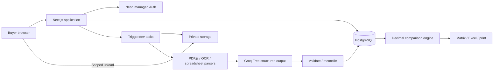

# FieldOps implementation plan

Agreed 2026-09-13. The complete requirements and acceptance source of truth are in [spec.md](spec.md).

**Accepted architecture change:** The owner explicitly chose Neon only after this plan was agreed. PostgreSQL, authentication and private files are now implemented through Neon; no Supabase project was created. The migration preserves the shared contracts and tested job/revision behavior. Current setup and outstanding account gates are recorded in [deployment.md](deployment.md); earlier Supabase milestones below are retained as plan history.

## Architecture

One fresh TypeScript/Next.js repository. Next.js App Router/React/Tailwind/Radix for the buyer UI. Neon Free provides PostgreSQL, managed Auth with GitHub OAuth and private object storage; allowlist controls live access. Trigger.dev Free handles cloud jobs. Shared processing functions also run locally for development/evaluation. Groq Free `openai/gpt-oss-120b` consumes parser/OCR text with strict validated outputs, source IDs and no tools. Decimal.js owns calculations. Vercel Hobby hosts the noncommercial public application. Public synthetic demo works independently of backend availability.

Keep UI, domain, processing and persistence separated by typed functions, not an agent framework. Share `FieldValue`, evidence, quotation, comparison, correction and match contracts across client and worker. Use relational ownership/version entities and persisted immutable snapshots for reproducibility. Job payloads only carry IDs.

## Implementation milestones and acceptance

| Milestone | Target | Concrete acceptance |
|---|---|---|
| Foundation | Day 1 | Fresh repo, saved spec/plan, typed contracts, migrations, allowlist/auth, design tokens, free-service readiness checks |
| Complete vertical slice | Days 2–3 | Two text quotations uploaded/parsed/extracted, evidence reviewed, corrected field persisted, match approved, scenario calculated, Excel and print output |
| Document breadth/recovery | Days 4–6 | Text/scan PDFs, PNG/JPEG, XLSX/CSV/paste; multipage evidence; duplicate/revision handling; cancel/retry preserves successes |
| Reliability/evaluation | Days 7–8 | Reproducible benchmark, baseline comparison, real results or explicit live blockers, consequential failures fixed, isolation/stale-write tests |
| Polish/release | Days 9–10 | Production build and deployed smoke check where free accounts available, accessible states, labelled demo, architecture/setup/case study/demo script |

## Implementation sequence

1. Establish shared domain types: decimal-string values, explicit missing states, immutable source spans, source-linked optional attributes, quoted/scenario separation, match classifications and approvals, corrections and revisions.
2. Build the full public sample workflow first, using saved extractions clearly marked as demonstration. Persist only visitor-local demo edits. Include workspace CRUD, all six views, evidence selection, immutable corrections, group actions, quantity scenarios and exports.
3. Implement deterministic domain calculations and compatibility gates, with direct unit tests. Apply known units, packages, MOQ/order increments and all-unit tiers; block unknown scope/pricing/charge/tax/currency assumptions. Preserve reconciliation discrepancies.
4. Implement parsers into immutable evidence/coverage manifests. Parse signatures/limits/encryption/ZIP expansion before expensive work. PDF.js handles text and rendering; Tesseract handles images; ExcelJS/csv-parse retain cell/record context. Failed pages mean incomplete extraction.
5. Implement genuine Groq extraction and matching with strict schemas, ID validation, versioned prompts, bounded chunks, output-token reservation, timeout/cancellation, checkpoints and quota waiting. Disable live inference without explicit free-tier/ZDR configuration. Never use fixtures as a live-provider fallback.
6. Implement local persistent storage and jobs for reproducible development, explicitly loopback-only. Implement authenticated Supabase repository and private upload/source routes with expected revisions, RLS and ownership checks. Persist intents before Trigger dispatch, reconcile outbox, fence commits and support retry/cancel/delete.
7. Connect the frontend to capability/status APIs and real uploads/polling. Show source originals and review recovery in both modes. Cloud unavailable is an explicit state, independent of demo availability.
8. Export pinned snapshots to Excel and print with original/scenario values, source index, assumptions and issues. Escape spreadsheet formulas and include currency/coverage labels.
9. Generate 24 self-authored benchmark quotations and eight robustness cases. Independently check gold. Evaluate baseline and AI separately, hold out four complete scenarios, preserve raw run configuration and avoid invented claims.
10. Run typecheck/lint/tests/build, focused browser/axe checks, parser format smoke tests and deployed checks. Fix material failures, document observed case-study failure and exact external blockers, and record results.

## API and persistence boundaries

Internal routes cover readiness, comparison CRUD, upload/finalization, run status/retry/cancel, private sources, versioned corrections/matches/scenarios and exports. Validate bodies and expected revisions. User/workspace identity comes from trusted authentication, not input. Local mode cannot be enabled on a public origin or hosting runtime. Originals remain private; source links are authenticated stable URLs.

Processing phases: queued → validating → parsing/OCR → extracting → reconciling → ready/partial, with separate failed/cancelled/waiting-quota states. Review completion is a separate property. Immutable extraction versions, corrections and attempt fencing prevent retries from overwriting newer edits. Idempotency protects application writes; do not claim exactly-once external inference.

Retention: originals/records until owner deletion within quota; seven-day disposable previews; 24-hour cached exports; immediate tombstone/access revocation and confirmed retryable purge. Use sanitised operational logs and reserve free quota for maintenance.

## Design direction

Procurement workspace, not a marketing landing page. Base colours: paper `#f7f8f5`, ink `#172f31`, teal `#17665d`, muted line `#dce3df`, amber `#9a5c12`, discrepancy `#b94137`. DM Sans provides readable UI hierarchy; IBM Plex Mono is limited to prices/identifiers. Dense aligned supplier columns, restrained borders and an evidence drawer carry the product identity. Avoid unnecessary cards and decorative gradients. Use sentence-case labels, concrete status copy, visible focus, reduced motion and text/icon alternatives to colour.

## Verification and release gates

- Domain: exact decimals, known/unknown conversions, package/MOQ/tier crossover, discounts and fees once, explicit tax bases, recurring service horizon, partial basket coverage, corrections invalidating approvals.
- Pipeline: signature/limit/protection detection, multipage coverage, OCR source geometry, merged cells/continuations, CSV records, unsupported/corrupt inputs, malformed AI output and injected instructions.
- Persistence/security: conflict on stale revisions, authenticated ownership, no cross-user sources, interrupted retry, cancellation/deletion fencing, duplicate vs revision, quota waiting.
- Browser: principal six-screen workflow, create/rename/delete, evidence clicking, correction/match/quantity changes, exports, mobile navigation, keyboard focus and axe.
- Evaluation: 24 originals / 8 scenarios, dev vs heldout split by scenario, eight separate robustness cases, real denominators and measured metrics, live-vs-fixture disclosures. Targets are 95% equivalence precision and 90% critical-field accuracy/item recall, not preclaimed results.
- Release: build runs; appropriate tests pass; setup reproduces behaviour; public demo labelled; real inference enabled only when verified free keys/data settings exist. Do not call unavailable cloud or unrun inference verified.

## Deployment gates and deferred scope

Check a new Supabase free slot without touching existing projects; configure free OAuth/allowlist; verify Trigger Free production onboarding without purchase; configure Groq Free key/ZDR; deploy to Vercel Hobby without billing changes. If setup is blocked, publish the safe demo where authorised free access exists and retain local pipeline plus precise instructions. No paid fallback. Deferred features are listed in spec.md.

## Working record

Maintain [progress.md](progress.md) with implementation state, commands/results, observed failures/fixes and precise credential/external blockers. Keep this goal active until the required implementation and verification are handled; do not claim completion based only on a polished fixture UI.
